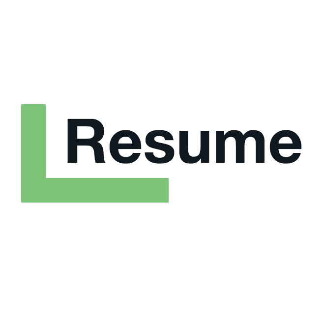

# Simple Resume

#### A Free and Open-Source Resume Builder That Respects Your Privacy

__Based on:__ [Reactive Resume](https://rxresu.me/)

Welcome to the front page of **Simple Resume**, a free and open-source Resume Builder web app that repects your **Privacy**. And a few other important features such as minimalistic UI, customizability, portability, regularly updated templates, etc. But the important things are, it is absolutely free to use, and your personal data never gets out of your browser.

We're going to use this coveted space to discuss about the features of the application, new changes that were introduced since the release and also other information like how to keep the project running through open-source code contribution.

## Web App & GitHub Repository

- [Web App ](https://simpleresume.ca/)
- [GitHub Repository ](https://github.com/SHENG-X/simple-resume)
